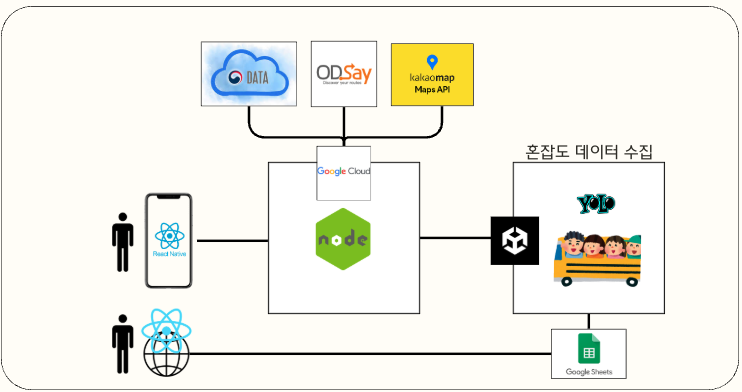
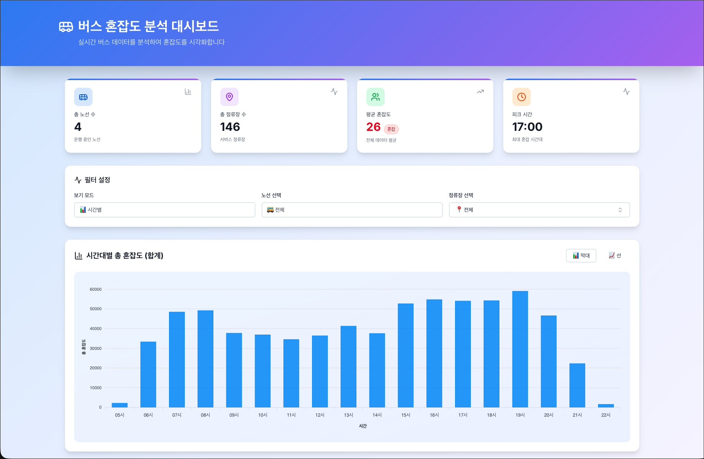
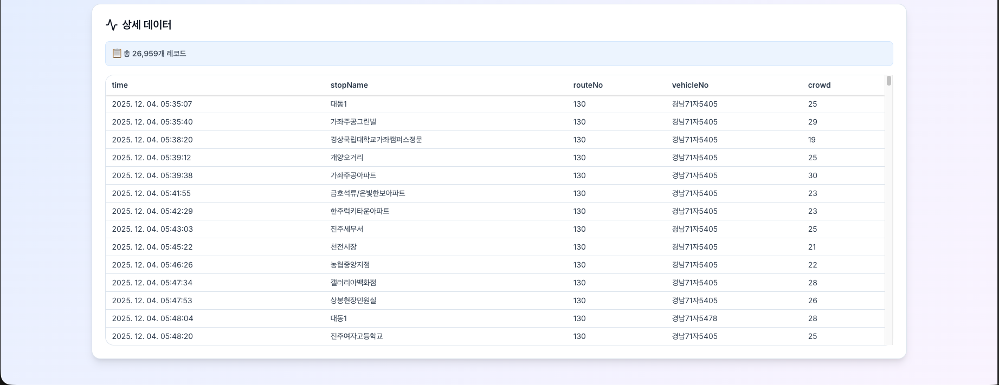
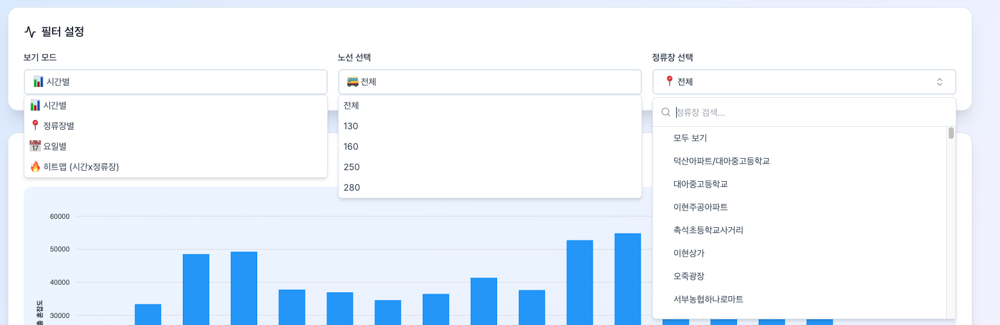
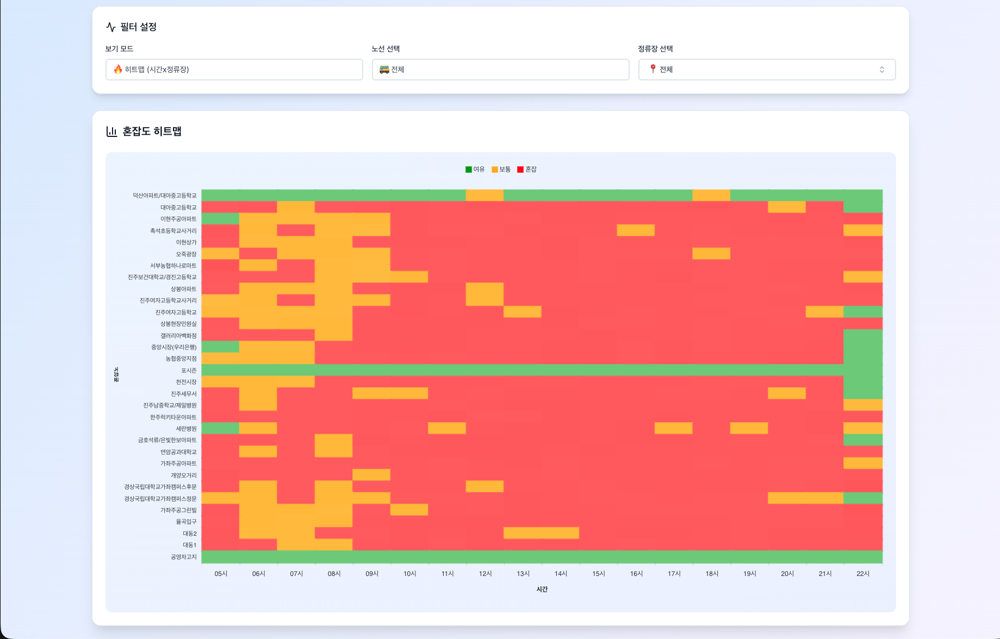

# 📊 BustleBus Web Dashboard
지방 도시의 고유한 교통 문제를 Unity 시뮬레이션 데이터와 YOLO 모델로 해결한 실시간 버스 혼잡도 모니터링 대시보드

## Repositories
* 🖥 **App**: [BustleBus-frontend](https://github.com/BustleBus/BustleBus-frontend)
* ⚙️ **Backend**: [BustleBus-backend](https://github.com/BustleBus/BustleBus-backend)
* 🎮 **Simulation**: [BustleBus-Unity](https://github.com/BustleBus/BustleBus-Unity)

## 🚍 프로젝트 배경
1. 실생활의 불편함: "정류장을 지나치는 버스"
학창 시절부터 대학생까지 경남 진주시에서 등하교하며, 하나의 노선이 6개가 넘는 중·고·대학교를 통과하는 현장을 지켜보았습니다. 피크 타임마다 버스는 늘 포화 상태였고, 노선 중간 지점에서는 버스가 꽉 차서 기사가 정류장을 무정차로 통과하는 상황이 빈번했습니다. "다음 버스는 탈 수 있을까?"라는 시민들의 막연한 불안함을 해결하고 싶었습니다.

2. 데이터의 공백: 지방 버스 시스템의 한계
서울이나 광역시와 달리, 많은 지방 도시는 단일 요금제를 채택하고 있습니다. 환승이 아니면 하차 시 카드를 찍지 않기 때문에, 버스 운영사는 '어디서 사람이 많이 내리는지'에 대한 정확한 데이터를 수집하기 어렵습니다. 데이터가 없으니 배차 간격 조절이 비효율적으로 이루어지는 악순환이 발생합니다.

3. 솔루션: 카메라 기반의 지능형 혼잡도 파악
카드 태그 데이터에 의존할 수 없다면 버스 내부의 시각 정보(CCTV)를 활용해야 한다고 판단했습니다.

사용자 측면: 실시간 혼잡도를 확인하여 "이번 버스를 탈 수 있을지" 판단 근거 제공

운영사 측면: 구간별 실제 탑승 인원 데이터를 기반으로 효율적인 배차 계획 수립 지원

---
## 🛠 기술적 접근 방식: 제약 조건 극복

### 🧊 Unity 3D 기반 가상 환경 구축
* **환경 모델링**: 실제 버스 내부 구조와 시트 배치, 정류장 환경을 Unity로 정교하게 구현
* **데이터 생성**: 다양한 캐릭터 에셋을 활용해 혼잡도별 시나리오를 연출하고, 개인정보 저촉 없는 학습용 이미지 데이터셋 확보

### 👁 YOLO 기반 객체 인식 및 혼잡도 분석
* Unity에서 추출한 이미지를 **YOLO** 모델로 학습시켜 실시간 승객 수와 위치 파악
* 법적 한계를 넘어선 기술적 실효성을 검증하고 해결책을 제시하는 **솔루션 제안형 캡스톤 디자인** 수행

---
## 🛠 기술스택

### Core
-   

### Styling & UI
- 
- **Radix UI**: 접근성이 보장된 Headless UI 컴포넌트
- **Shadcn/ui**: 재사용 가능한 컴포넌트 시스템
- **Lucide React**: 모던한 아이콘 라이브러리

### Data Visualization & Performance
- **ApexCharts**: 인터랙티브한 차트 및 데이터 시각화
- **TanStack Virtual**: 대량 데이터 리스트의 가상화 렌더링 최적화

## ✨ Key Features (Web)

- **가상화 스크롤 (Virtualized Scrolling)**: TanStack Virtual을 도입하여 브라우저 메모리 사용량을 최소화하면서 수천 개의 데이터 리스트를 부드럽게 렌더링합니다.
- **실시간 데이터 시각화**: ApexCharts를 활용하여 웹 브라우저 상에서 버스 혼잡도 히트맵과 통계 차트를 직관적으로 보여줍니다.
- **웹 접근성(Web Accessibility)**: WAI-ARIA 표준을 준수하는 Radix UI를 사용하여 키보드 및 스크린 리더 사용자를 지원합니다.
- **반응형 웹 디자인**: 데스크탑, 태블릿, 모바일 브라우저 환경에 맞춰 레이아웃이 유동적으로 조정됩니다.

## Architecture



## 📺 UI / Demo
># **https://web-ten-nu-64.vercel.app/** <br>

| **메인 대시보드 (Overview)** | **상세 데이터 (List View)** |
| :---: | :---: |
|  |  |
| **검색 및 필터링 (Filtering)** | **히트맵 시각화 (Heatmap)** |
|  |  |


## 🚀 Getting Started

로컬 웹 환경에서 프로젝트를 실행하는 방법입니다.

### Prerequisites
- Node.js (v18 이상 권장)
- npm

### Installation

1. 웹 리포지토리를 클론합니다.
   ```bash
   git clone https://github.com/username/bustlebus-web.git
   cd bustlebus-web
   ```

2. 의존성 패키지를 설치합니다.
   ```bash
   npm install
   ```

3. 개발 서버를 실행합니다.
   ```bash
   npm run dev
   ```
   브라우저에서 `http://localhost:5173`으로 접속하여 확인합니다.

### Build

웹 프로덕션 배포를 위한 빌드:
```bash
npm run build
```

## 📂 Project Structure

```
src/
├── components/
│   ├── ui/               # 공통 UI 컴포넌트 (Button, Dialog 등)
│   └── Dashboard.tsx     # 웹 대시보드 메인 컴포넌트
├── lib/
│   ├── utils.ts          # 스타일 병합 등 유틸리티
│   └── chartUtils.ts     # 차트 데이터 가공 로직
├── App.tsx               # 라우팅 및 레이아웃 설정
├── main.tsx              # React Entry Point
└── index.css             # TailwindCSS 설정
```

